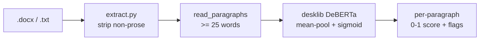

```
 █████╗ ██╗      ██████╗ ███████╗████████╗███████╗ ██████╗████████╗
██╔══██╗██║      ██╔══██╗██╔════╝╚══██╔══╝██╔════╝██╔════╝╚══██╔══╝
███████║██║█████╗██║  ██║█████╗     ██║   █████╗  ██║        ██║
██╔══██║██║╚════╝██║  ██║██╔══╝     ██║   ██╔══╝  ██║        ██║
██║  ██║██║      ██████╔╝███████╗   ██║   ███████╗╚██████╗   ██║
╚═╝  ╚═╝╚═╝      ╚═════╝ ╚══════╝   ╚═╝   ╚══════╝ ╚═════╝   ╚═╝
```
<div align="center">

### `SCORE YOUR OWN PROSE // BEFORE A TEACHER SCORES IT FOR YOU`

*a local, offline AI-writing detector for drafts you actually wrote*


-111111?style=flat-square&labelColor=111111)

</div>

---

## 🔍 What is this

A command-line tool that reads a `.docx` or `.txt` and scores each paragraph
0–1 on how AI-generated it reads, using the `desklib/ai-text-detector-v1.01`
DeBERTa model — the one sitting at #1 on the RAID benchmark. Everything runs
on your own machine; after the first model download it never touches the
network. You point it at your Extended Essay, it tells you which paragraphs
sound like a language model wrote them.

The point isn't to cheat a detector. It's the opposite: I write my own drafts,
and sometimes my own honest prose still trips these classifiers because that's
what earnest formal writing looks like to them. This flags those paragraphs so
I can reword before a teacher runs Turnitin and has an awkward conversation
with me about it.

It is directional, not oracular. A high score means "reword this," not "you're
caught." It is not, and cannot be, the number Turnitin shows a teacher.

```console
nick@ai-detect:~$ python detect.py EE-clean.txt
P  1   0.08  [##------------------]
P  2   0.71  [##############------]  <-- AI-ish
average AI score: 0.34   |   1/6 paragraphs flagged
reminder: directional only, not a Turnitin score.
```

## 🧠 The detection engine

| | feature | what it actually does |
|---|---|---|
| 01 | **per-paragraph scoring** | what it actually catches — splits your draft and scores each paragraph, so you fix the two bad ones instead of rewriting everything |
| 02 | **docx + txt input** | reads Word files straight (paragraphs, no headings) or plain text split on blank lines |
| 03 | **prose extractor** | `extract.py` strips headings, bullets, footnotes and your own note-scaffolding first, so the score is about writing, not structure |
| 04 | **offline after setup** | first run pulls ~1.5GB of model, every run after is airgapped — your essay never leaves the laptop |
| 05 | **second opinion** | cross-check against the lighter [Ejhfast/fast-ai-detector] when one model's paranoia isn't enough |
| 06 | **Binoculars (shelved)** | a training-free perplexity-ratio detector — tried, measured, and parked; see below for why it doesn't work on an 18GB Mac |

## 🚀 Run it

Needs Python and a machine that can hold a DeBERTa model (built and tested on
an 18GB Apple Silicon Mac, MPS-accelerated).

```bash
git clone https://github.com/nitrimandylis/ai-detect.git
cd ai-detect
pip install -r requirements.txt

python detect.py "path/to/draft.docx"     # score a whole draft
python detect.py --text "one sentence"    # score a single string
```

First run downloads the model and will sit there for a minute — that's normal,
not a hang. Every run after is fast and offline.

## 🔩 Under the hood



| file | job |
|---|---|
| `detect.py` | loads the desklib model, scores each paragraph, prints the bars and flags |
| `extract.py` | pulls clean prose out of a `.docx` into a `.txt` — drops headings, bullets, note-labels |
| `binoculars.py` | training-free perplexity-ratio scorer over a base+instruct LM pair (shelved, see below) |
| `calibrate.py` | scores the labelled `calibration/` set, finds the threshold, then checks a draft |
| `test_binoculars.py` | math + threshold self-checks, no model download |
| `requirements.txt` | torch · transformers · python-docx |

## 🔭 Binoculars: tried, measured, shelved

[Binoculars](https://arxiv.org/abs/2401.12070) is a training-free detector: run
text through two LMs that share a tokenizer (a base "observer" and an instruct
"performer") and divide perplexity by cross-perplexity. Its designed model pair
is Falcon-7B ×2 (~28GB) — too big for an 18GB Mac. So I swapped in a small
same-family pair (Qwen2.5-0.5B, or 1.5B) that fits.

Then I actually measured it. `calibrate.py` scores a labelled set — 12 real
pre-2020 IB Extended Essay paragraphs vs 12 LLM-written ones on the same topics
— and finds the best separating threshold:

| pair | best separation | chance |
|---|---|---|
| Qwen2.5-0.5B | 62% | 50% |
| Qwen2.5-1.5B | 67% | 50% |

Barely above a coin flip. The human and AI score clusters almost completely
overlap, because the perplexity gap Binoculars exploits is sharp in 7B models
and mush in sub-2B ones. **It's kept as a documented negative result, not a
detector to trust.** desklib stays the primary. Run `python calibrate.py` to
reproduce the numbers.

**Stack:** python · pytorch · transformers · desklib DeBERTa

The lighter cross-check tool lives at [Ejhfast/fast-ai-detector] — it's a
separate repo, not vendored here.

---

<div align="center">

**[Nick Trimandylis](https://github.com/nitrimandylis)**

`I WRITE MY OWN ESSAYS — THIS JUST CHECKS THEY STILL READ LIKE IT`

MIT licensed — see [LICENSE](LICENSE).

</div>

[Ejhfast/fast-ai-detector]: https://github.com/Ejhfast/fast-ai-detector
