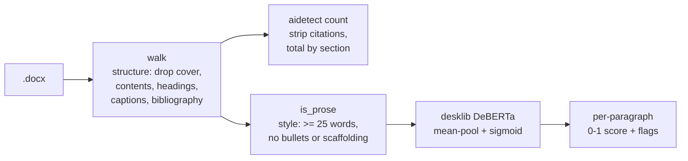

```
 █████╗ ██╗      ██████╗ ███████╗████████╗███████╗ ██████╗████████╗
██╔══██╗██║      ██╔══██╗██╔════╝╚══██╔══╝██╔════╝██╔════╝╚══██╔══╝
███████║██║█████╗██║  ██║█████╗     ██║   █████╗  ██║        ██║
██╔══██║██║╚════╝██║  ██║██╔══╝     ██║   ██╔══╝  ██║        ██║
██║  ██║██║      ██████╔╝███████╗   ██║   ███████╗╚██████╗   ██║
╚═╝  ╚═╝╚═╝      ╚═════╝ ╚══════╝   ╚═╝   ╚══════╝ ╚═════╝   ╚═╝
```
<div align="center">

### `SCORE YOUR OWN PROSE // BEFORE A TEACHER SCORES IT FOR YOU`

*a local, offline AI-writing detector and IB word counter for drafts you actually wrote*


-111111?style=flat-square&labelColor=111111)

</div>

---

## 🔍 What is this

A command-line tool that reads a `.docx` or `.txt` and scores each paragraph
0–1 on how AI-generated it reads, using the `desklib/ai-text-detector-v1.01`
DeBERTa model — the one sitting at #1 on the RAID benchmark. Everything runs
on your own machine; after the first model download it never touches the
network. You point it at your Extended Essay, it tells you which paragraphs
sound like a language model wrote them.

The point isn't to cheat a detector. It's the opposite: I write my own drafts,
and sometimes my own honest prose still trips these classifiers because that's
what earnest formal writing looks like to them. This flags those paragraphs so
I can reword before a teacher runs Turnitin and has an awkward conversation
with me about it.

It is directional, not oracular. A high score means "reword this," not "you're
caught." It is not, and cannot be, the number Turnitin shows a teacher.

```console
nick@aidetect:~$ aidetect score EE-clean.txt
P  1   0.08  [##------------------]
P  2   0.71  [##############------]  <-- AI-ish
average AI score: 0.34   |   1/6 paragraphs flagged
reminder: directional only, not a Turnitin score.
```

## 🧠 The detection engine

| | feature | what it actually does |
|---|---|---|
| 01 | **per-paragraph scoring** | what it actually catches — splits your draft and scores each paragraph, so you fix the two bad ones instead of rewriting everything |
| 02 | **docx + txt input** | reads Word files through the same walker `count` uses — no cover page, no contents, no headings, no bibliography — or plain text split on blank lines |
| 03 | **prose extractor** | `aidetect extract` dumps a draft's countable prose to a `.txt` so you can eyeball exactly what got counted |
| 04 | **offline after setup** | first run pulls ~1.5GB of model, every run after is airgapped — your essay never leaves the laptop |
| 05 | **second opinion** | cross-check against the lighter [Ejhfast/fast-ai-detector] when one model's paranoia isn't enough |
| 06 | **Binoculars (Gemma 4)** | a training-free perplexity-ratio detector — near chance with small Qwen pairs, but 96% on the labelled set once swapped to a Gemma 4 pair; see below |
| 07 | **IB word count** | `aidetect count` (`--json` for scripts and agents) counts what the IB counts — no cover page, contents, headings, captions, tables, footnotes, citations or bibliography — and splits the total by section and sub-section, so an over-long draft tells you *where* |

## 🚀 Run it

```bash
uv tool install aidetect      # or: pipx install aidetect
```

```bash
aidetect                                   # list the five subcommands
aidetect count "draft.docx" --limit 4000   # IB word count, by section
aidetect count "draft.docx" --json         # same, as one JSON object
aidetect extract "draft.docx"              # -> "draft prose.txt", what got counted
aidetect score "draft.docx"                # score a whole draft
aidetect score --text "one sentence"       # score a single string
aidetect bino  "draft.docx" --mlx --pair gemma
```

`count` and `extract` are instant and need no model. `score` and `bino` need a
machine that can hold a transformer: built and tested on an 18GB Apple Silicon
Mac, MPS-accelerated. Their first run downloads the model and will sit there for
a minute — that's normal, not a hang. Every run after is fast and offline.

On Apple Silicon the Gemma 4 MLX pair installs automatically. Elsewhere it is
skipped and the Qwen pairs still work.

### `--json`

`count` takes `--json` and prints exactly one object on stdout, nothing else:

```json
{"sections": [{"title": "Introduction", "words": 812, "level": 1},
              {"title": "Analysis", "words": 0, "level": 1},
              {"title": "Porter's Five Forces", "words": 1021, "level": 2}],
 "total": 3940, "limit": 4000, "over": -60}
```

Every key is always present. `limit` and `over` are `null` when no `--limit` was
given — that means "does not apply", not "could not be read". A draft with no
prose is an empty `sections` list and exit 0. Errors go to stderr with a non-zero
exit, so consumers branch on the exit code rather than parsing error text.

`words` is a section's *own* words, never its children's, so `sum(words)` equals
`total` and nothing double-counts. The table you see rolls sub-sections up into
their parent for display; do the same yourself with `level` if you want subtotals.

### What counts

Excluded by *position*, not by wording: everything before the first heading (the
cover page), the Table of Contents section, headings themselves, `Figure 3: ...`
captions, tables, footnotes, and everything from the Bibliography heading on.
In-text citations are stripped from the paragraphs that survive.

Block quotes and body bullet lists **do** count — they are assessed prose. A
caption needs its colon to be dropped, so `Figure 4 shows revenue rising` is
counted while `Figure 4: Revenue, 2021–2025` is not. A draft with no headings at
all is counted whole, with a note, rather than reporting a confident zero.

## 🔩 Under the hood



One walker decides what is *in* the document; two thin filters decide what each
job wants from it. A 6-word sentence is a word the examiner counts and noise to
the detector, which is the whole reason the split exists.

| file | job |
|---|---|
| `src/aidetect/cli.py` | the `aidetect` entry point — dispatches subcommands, importing each lazily so `count` never loads torch |
| `src/aidetect/text.py` | shared, torch-free: `walk()` reads a `.docx`'s structure once, `is_prose()` is the detector's separate style filter |
| `src/aidetect/count.py` | the IB word count — sections, rollup, citation stripping, budget |
| `src/aidetect/detect.py` | loads the desklib model, scores each paragraph, prints the bars and flags |
| `src/aidetect/extract.py` | dumps a `.docx`'s countable prose into a `.txt`, the same words `count` counts |
| `src/aidetect/binoculars.py` | training-free perplexity-ratio scorer over a base+instruct LM pair (Qwen, or Gemma 4 via `--mlx`; see below) |
| `src/aidetect/calibrate.py` | fits a threshold on a labelled set you supply, saves it to `~/.config/aidetect` |
| `src/aidetect/paths.py` | where thresholds are looked up — `~/.config/aidetect` first, then the ones in the package |
| `src/aidetect/thresholds/` | the thresholds shipped with the package; a threshold you fit yourself wins over these |
| `corpora/` | my labelled calibration sets. Repo-only, deliberately not shipped in the package |
| `tests/` | count rules and Binoculars math, both self-checking, no model download |
| `pyproject.toml` | package metadata and dependencies — torch · transformers · python-docx, plus mlx-vlm on Apple Silicon |

## 🔭 Binoculars: shelved, then revived by Gemma 4

[Binoculars](https://arxiv.org/abs/2401.12070) is a training-free detector: run
text through two LMs that share a tokenizer (a base "observer" and an instruct
"performer") and divide perplexity by cross-perplexity. Its designed model pair
is Falcon-7B ×2 (~28GB) — too big for an 18GB Mac, so the fallback was a small
same-family pair (Qwen2.5-0.5B or 1.5B) that fits.

`aidetect calibrate` scores a labelled set — mine is 12 real pre-2020 IB Extended
Essay paragraphs vs 12 LLM-written ones on the same topics — and finds the best
separating threshold. Measured across pairs:

| pair | best separation | chance |
|---|---|---|
| Qwen2.5-0.5B | 62% | 50% |
| Qwen2.5-1.5B | 67% | 50% |
| **Gemma 4 E2B** | **96%** | 50% |

The Qwen pairs sit near a coin flip: their human and AI score clusters almost
completely overlap, because the perplexity gap Binoculars exploits is sharp in
larger models and mush in sub-2B ones. That was the original negative result.
Swapping in a **Gemma 4** pair opens a clean gap (human mean 0.90 vs AI 0.71)
and separates the set at 96%. Gemma 4 ships as a multimodal checkpoint, so
`--mlx` quantizes it to 4-bit and runs it text-only through
[mlx-vlm](https://github.com/Blaizzy/mlx-vlm), fitting the 18GB Mac in ~6GB:

```bash
aidetect bino IA-clean.txt --mlx --pair gemma   # uses the shipped threshold

# refit the threshold on your own labelled set
aidetect calibrate --human-dir corpora/human --ai-dir corpora/ai --mlx --pair gemma
```

desklib stays the primary detector; Binoculars is now a usable second opinion
rather than a dead end. The calibration sets are not shipped with the package —
clone the repo to reproduce the numbers, or point `--human-dir`/`--ai-dir` at
your own. Your fitted threshold lands in `~/.config/aidetect` and takes
precedence over the shipped one, so it survives an upgrade.

## 🧪 The peer set: genre context, not a human class

The 12 human samples are Extended Essays: English, History, Biology, Physics,
Philosophy. A CS IA is a different animal, all database schemas, GUI components and
method-by-method justification, and technical prose is inherently more
predictable token-by-token, which drags perplexity-ratio scores down no matter
who typed it. So a CS IA scoring below the EE human mean means less than it
looks.

`corpora/peer/` holds 12 paragraphs of real IB Computer Science IA prose
(5 projects, 5 authors: sudokuMaster, IBOrganizer, MyCalendar, and two
IBO-published new-syllabus specimens). Measured against the same anchors:

| set | Binoculars mean | desklib mean |
|---|---|---|
| human (2008 EEs, verified pre-2020) | **0.90** | n/a |
| **peer (CS IAs, 2021–2025)** | **0.85** | **0.46** |
| ai (LLM-written, matched topics) | **0.71** | n/a |

The genre gap is real and it is about 0.05 on Binoculars. Score your IA against
`peer`, not against `human`.

**It is not a human class and it never fits a threshold.** Every source
postdates ChatGPT; three of the five were written in 2025. None carries an
authorship attestation, and in 2025 a fair share of student IAs were not
written unaided. Fold that into `human/` and any AI-assisted sample drags the
mean down, lowers the threshold, and the tool starts clearing drafts for the
wrong reason, a detector that reassures instead of measures. `aidetect calibrate`
reads only the two folders you name, so `peer/` stays out of threshold fitting
by construction, not by discipline.

What it can tell you: *"my prose scores like other IAs in this genre."* What it
can never tell you: *"my prose is human."* Matching a set you cannot vouch for
proves you are not an outlier, nothing more.

**Stack:** python · pytorch · transformers · mlx-vlm · desklib DeBERTa

The lighter cross-check tool lives at [Ejhfast/fast-ai-detector] — it's a
separate repo, not vendored here.

---

<div align="center">

**[Nick Trimandylis](https://github.com/nitrimandylis)**

`I WRITE MY OWN ESSAYS — THIS JUST CHECKS THEY STILL READ LIKE IT`

MIT licensed — see [LICENSE](LICENSE).

</div>

[Ejhfast/fast-ai-detector]: https://github.com/Ejhfast/fast-ai-detector
