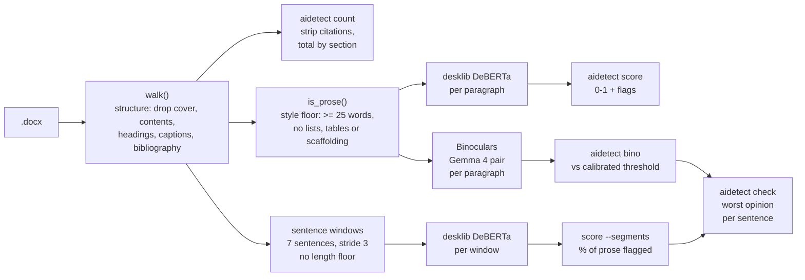

```
 █████╗ ██╗      ██████╗ ███████╗████████╗███████╗ ██████╗████████╗
██╔══██╗██║      ██╔══██╗██╔════╝╚══██╔══╝██╔════╝██╔════╝╚══██╔══╝
███████║██║█████╗██║  ██║█████╗     ██║   █████╗  ██║        ██║
██╔══██║██║╚════╝██║  ██║██╔══╝     ██║   ██╔══╝  ██║        ██║
██║  ██║██║      ██████╔╝███████╗   ██║   ███████╗╚██████╗   ██║
╚═╝  ╚═╝╚═╝      ╚═════╝ ╚══════╝   ╚═╝   ╚══════╝ ╚═════╝   ╚═╝
```
<div align="center">

### `SCORE YOUR OWN PROSE // BEFORE A TEACHER SCORES IT FOR YOU`

*a local, offline AI-writing detector and IB word counter for drafts you actually wrote*


-111111?style=flat-square&labelColor=111111)

</div>

---

## 🔍 What is this

A command-line tool that reads a `.docx` or `.txt` and scores each paragraph
0–1 on how AI-generated it reads, using the `desklib/ai-text-detector-v1.01`
DeBERTa model — the one sitting at #1 on the RAID benchmark. Everything runs
on your own machine; after the first model download it never touches the
network. You point it at your Extended Essay, it tells you which paragraphs
sound like a language model wrote them.

The point isn't to cheat a detector. It's the opposite: I write my own drafts,
and sometimes my own honest prose still trips these classifiers because that's
what earnest formal writing looks like to them. This flags those paragraphs so
I can reword before a teacher runs Turnitin and has an awkward conversation
with me about it.

It is directional, not oracular. A high score means "reword this," not "you're
caught." It is not, and cannot be, the number Turnitin shows a teacher.

```console
nick@aidetect:~$ aidetect score EE-clean.txt
P  1   0.08  [##------------------]
P  2   0.71  [##############------]  <-- AI-ish
average AI score: 0.34   |   1/6 paragraphs flagged
reminder: directional only, not a Turnitin score.
```

## 🧠 The detection engine

| | feature | what it actually does |
|---|---|---|
| 01 | **per-paragraph scoring** | what it actually catches — splits your draft and scores each paragraph, so you fix the two bad ones instead of rewriting everything |
| 02 | **docx + txt input** | reads Word files through the same walker `count` uses — no cover page, no contents, no headings, no bibliography — or plain text split on blank lines |
| 03 | **prose extractor** | `aidetect extract` dumps a draft's countable prose to a `.txt` so you can eyeball exactly what got counted |
| 04 | **offline after setup** | first run pulls ~1.5GB of model, every run after is airgapped — your essay never leaves the laptop |
| 05 | **optional third opinion** | [Ejhfast/fast-ai-detector], a separate lighter tool, for when both built-in detectors agree and you still want another read. Not part of any verdict |
| 06 | **Binoculars (Gemma 4)** | a training-free perplexity-ratio detector — near chance with small Qwen pairs, but 92% on the labelled set once swapped to a Gemma 4 pair; see below |
| 07 | **IB word count** | `aidetect count` (`--json` for scripts and agents) counts what the IB counts — no cover page, contents, headings, captions, tables, footnotes, citations or bibliography — and splits the total by section and sub-section, so an over-long draft tells you *where* |
| 08 | **Turnitin-shaped segments** | `score --segments` slides overlapping 7-sentence windows across the prose — short connective paragraphs included, the ones paragraph mode skips — and reports *% of prose in flagged segments*, the same shape as Turnitin's headline number |
| 09 | **combined verdict** | `aidetect check` runs the desklib segments and Binoculars over the same draft and takes the worst opinion per sentence — disagreement between detectors surfaces instead of averaging away |

## 🚀 Run it

```bash
uv tool install aidetect      # or: pipx install aidetect
```

```bash
aidetect                                   # list the seven subcommands
aidetect count "draft.docx" --limit 4000   # IB word count, by section
aidetect count "draft.docx" --json         # same, as one JSON object
aidetect extract "draft.docx"              # -> "draft prose.txt", what got counted
aidetect score "draft.docx"                # score a whole draft, paragraph by paragraph
aidetect score "draft.docx" --segments     # Turnitin-shaped: % of prose in flagged windows
aidetect score --text "one sentence"       # score a single string
aidetect bino  "draft.docx" --mlx --pair gemma
aidetect check "draft.docx"                # both detectors, worst opinion wins
```

`count` and `extract` are instant and need no model. `score` and `bino` need a
machine that can hold a transformer: built and tested on an 18GB Apple Silicon
Mac, MPS-accelerated. Their first run downloads the model and will sit there for
a minute — that's normal, not a hang. Every run after is fast and offline.

On Apple Silicon the Gemma 4 MLX pair installs automatically. Elsewhere it is
skipped and the Qwen pairs still work.

### `--json`

`count` takes `--json` and prints exactly one object on stdout, nothing else:

```json
{"sections": [{"title": "Introduction", "words": 812, "level": 1},
              {"title": "Analysis", "words": 0, "level": 1},
              {"title": "Porter's Five Forces", "words": 1021, "level": 2}],
 "total": 3940, "limit": 4000, "over": -60}
```

Every key is always present. `limit` and `over` are `null` when no `--limit` was
given — that means "does not apply", not "could not be read". A draft with no
prose is an empty `sections` list and exit 0. Errors go to stderr with a non-zero
exit, so consumers branch on the exit code rather than parsing error text.

`words` is a section's *own* words, never its children's, so `sum(words)` equals
`total` and nothing double-counts. The table you see rolls sub-sections up into
their parent for display; do the same yourself with `level` if you want subtotals.

### What counts

Excluded by *position*, not by wording: everything before the first heading (the
cover page), the Table of Contents section, headings themselves, `Figure 3: ...`
captions, tables, footnotes, and everything from the Bibliography heading on.
In-text citations are stripped from the paragraphs that survive.

Block quotes and body bullet lists **do** count — they are assessed prose. A
caption needs its colon to be dropped, so `Figure 4 shows revenue rising` is
counted while `Figure 4: Revenue, 2021–2025` is not. A draft with no headings at
all is counted whole, with a note, rather than reporting a confident zero.

## 🔩 Under the hood



One walker decides what is *in* the document; everything downstream is a
different question asked of the same paragraphs. A 6-word sentence is a word the
examiner counts and noise to a paragraph scorer, which is why `count` and
`is_prose` are separate filters rather than one.

The two scoring paths differ on purpose. List items never reach either detector. Bullets, `1.`/`1)` numbering, labelled
criteria like `SC12` or `FR3`, and tab-separated table rows are filtered by
`is_list_item()` in `text.py`, which `is_prose()` calls. This matters most in
segment mode, which drops the word floor on purpose: without the filter a CS
IA's success-criteria table and its numbered design breakdown reached the
detector as prose and drove 16% of that draft into the flagged bucket, which
measures formatting rather than writing. Single-letter items (`a)`) and roman
numerals are deliberately *not* filtered, because they cannot be told apart
from an initial opening a sentence, and dropping a paragraph that begins
"T. S. Eliot wrote..." is the worse error. `count` is unaffected: the examiner
counts those words, so the IB word count still does too.

**Paragraph mode** applies the 25-word
floor, because a fragment scores as noise on its own. **Segment mode** drops it
and slides overlapping windows instead, so those same short connective sentences
get scored inside a window with their neighbours — and formulaic linking prose is
exactly what detectors flag. `check` runs the segment path and Binoculars
together and takes the worse verdict per sentence.

| file | job |
|---|---|
| `src/aidetect/cli.py` | the `aidetect` entry point — dispatches subcommands, importing each lazily so `count` never loads torch |
| `src/aidetect/text.py` | shared, torch-free: `walk()` reads a `.docx`'s structure once, `is_prose()` is the detector's separate style filter |
| `src/aidetect/count.py` | the IB word count — sections, rollup, citation stripping, budget |
| `src/aidetect/detect.py` | loads the desklib model, scores each paragraph, prints the bars and flags |
| `src/aidetect/segments.py` | torch-free window arithmetic for `--segments` and `check`: sentence split, overlapping windows, worst-window scores, red/amber/clean |
| `src/aidetect/check.py` | runs both detectors over one draft and unions the verdicts — worst opinion wins, no ensemble weights |
| `src/aidetect/extract.py` | dumps a `.docx`'s countable prose into a `.txt`, the same words `count` counts |
| `src/aidetect/binoculars.py` | training-free perplexity-ratio scorer over a base+instruct LM pair (Qwen, or Gemma 4 via `--mlx`; see below) |
| `src/aidetect/calibrate.py` | fits a threshold on a labelled set you supply, saves it to `~/.config/aidetect` |
| `src/aidetect/generate.py` | generates the AI half of a calibration set through NVIDIA NIM, with no system prompt and no style guidance, so the adversary stays fair |
| `src/aidetect/paths.py` | where thresholds are looked up — `~/.config/aidetect` first, then the ones in the package |
| `src/aidetect/thresholds/` | the thresholds shipped with the package; a threshold you fit yourself wins over these |
| `pyproject.toml` sdist excludes | `corpora`, `tests`, `tools` — `tests/fixtures/` holds the same essay excerpts as `corpora/`, so shipping the tests would redistribute what `corpora/` is withheld to protect |
| `corpora/` | labelled calibration sets: `human`/`ai` (humanities) and `human-tech`/`ai-tech` (maths, CS, science), plus `peer` for genre context. Repo-only, deliberately not shipped in the package, and **not covered by this repo's MIT licence** — see `corpora/README.md` |
| `tools/fetch_exemplars.sh` | downloads the 48 IBO exemplars from the Wayback Machine |
| `tools/ocr.swift` | macOS Vision OCR for one page image; prints text plus line geometry as TSV. Compiled on demand by `run_ocr.sh`, never committed |
| `tools/run_ocr.sh`, `tools/ocr_all.sh` | render a scan to 200 dpi pages and OCR it, one essay or a whole folder |
| `tools/build_corpus.py` | turns scanned Extended Essays into corpus samples: paragraphs rebuilt from line geometry, footnote superscripts stripped, three paragraphs picked per essay |
| `tools/ocr_bias.py` | measures what OCR does to a score, on the same prose read both ways |
| `tests/` | count rules, Binoculars math, segment windows, corpus stripping and calibration grouping, all self-checking, no model download |
| `tests/fixtures/known_clean/` | the 24 hand-picked samples that predate the OCR pipeline; the strip rules must never edit them |
| `pyproject.toml` | package metadata and dependencies — torch · transformers · python-docx, plus mlx-vlm on Apple Silicon |

## 🔭 Binoculars: shelved, then revived by Gemma 4

[Binoculars](https://arxiv.org/abs/2401.12070) is a training-free detector: run
text through two LMs that share a tokenizer (a base "observer" and an instruct
"performer") and divide perplexity by cross-perplexity. Its designed model pair
is Falcon-7B ×2 (~28GB) — too big for an 18GB Mac, so the fallback was a small
same-family pair (Qwen2.5-0.5B or 1.5B) that fits.

`aidetect calibrate` scores a labelled set and finds the best separating
threshold. Mine is 132 paragraphs from 44 real pre-2020 IB Extended Essays,
three per essay, against one LLM-written paragraph each on the same topic and
from the same position in the essay.

The pair comparison below was measured on the earlier 12-vs-12 set, and the
shipped Binoculars thresholds still come from that fit:

| pair | best separation | chance |
|---|---|---|
| Qwen2.5-0.5B | 62% | 50% |
| Qwen2.5-1.5B | 67% | 50% |
| **Gemma 4 E2B** | **92%** | 50% |

The Qwen pairs sit near a coin flip: their human and AI score clusters almost
completely overlap, because the perplexity gap Binoculars exploits is sharp in
larger models and mush in sub-2B ones. That was the original negative result.
Swapping in a **Gemma 4** pair opens a clean gap (human mean 0.90 vs AI 0.69)
and separates the set at 92%. Gemma 4 ships as a multimodal checkpoint, so
`--mlx` quantizes it to 4-bit and runs it text-only through
[mlx-vlm](https://github.com/Blaizzy/mlx-vlm), fitting the 18GB Mac in ~6GB:

```bash
aidetect bino IA-clean.txt --mlx --pair gemma   # uses the shipped threshold

# refit the threshold on your own labelled set
aidetect calibrate --human-dir corpora/human --ai-dir corpora/ai --mlx --pair gemma
```

### The AI class has to be a fair adversary

`aidetect generate` builds the AI half of a calibration set by calling a hosted
model through [NVIDIA NIM](https://build.nvidia.com) with **no system prompt and
no style guidance** — only a topic and a word count:

```bash
export NVIDIA_API_KEY=nvapi-...     # you set it; aidetect only reads the env var
aidetect generate --topics corpora/human-tech/manifest.json \
                  --out-dir corpora/ai-tech --prefix ta --seed 7
```

By default it reads NIM's live catalog and **samples popular models across
vendors**, one per topic, so the class carries a spread of tokenizers,
architectures and training mixes rather than one model's habits. Models that
NIM has stopped serving are dropped rather than 404-ing mid-run, `--seed` makes
an assignment reproducible, and `--model` pins exact ids instead.

When a human entry records a `position` (which third of the essay its paragraph
came from), the prompt asks for that section. It is a structural instruction,
the same kind as the word count, and it exists so the AI class carries the same
introduction/analysis/conclusion spread the human class does. Without it every
AI sample lands in the same generic mid-essay register, and that difference is
learnable without being anything to do with human versus machine.

`--workers` requests several completions at once, which matters when the usable
models differ in speed by more than 10x: one large model can legitimately take
around two minutes while others answer in ten seconds, and sequentially the slow
ones block everything. Raise it too far and NIM answers 429. `--timeout` sets how
long one completion may take; the default of 180s is deliberately generous
because a tighter limit retires working models as though they were dead.

Transient failures are counted **per sample, not per model**. A 429 says that
*model* is busy this minute and nothing about your account: build.nvidia.com is
free and rate limited rather than credit based, "dependent on model, use-case
and the amount of current overall traffic using the same access". Measured, two
models can return 429 while four others answer 200 in the same second, so a 429
switches model rather than sleeping, and only a 429 from every model is worth
waiting out. a reasoning trace
instead of a paragraph is one bad roll at temperature 1.0. Counting either over
a model's whole run guarantees that any model which slips occasionally is
retired somewhere in a long corpus, which silently collapses the class onto the
two or three models that never slip. The Gemma
family is never sampled: it is the detector's own pair, and scoring Gemma output
with a Gemma observer/performer would flatter the detector.

This exists because of a real failure. An earlier AI set was written by an
assistant carrying house style rules (write tightly, no em dashes, active voice)
and came out stylometrically *indistinguishable from the human class* it was
supposed to oppose — mean sentence length 25.8 against the humans' 24.5, where a
properly untuned AI class ran to 35.1. A too-human AI class pulls the clusters
together, lowers the threshold and makes the detector **more lenient**, which is
the false-negative direction this tool exists to avoid. That set is quarantined
in `corpora/ai-tech/` with the numbers written down.

Repeat `--model` to rotate models across topics so the class is not one model's
quirks, and prefer a family different from the detector's own pair. The output
manifest records the model, temperature and exact prompt template for every
sample, so any threshold fitted on it can be audited.

### Genre thresholds: `--tag`

The boundary is not only per model pair, it is **per genre**. Fitted on 12 real
pre-2013 technical Extended Essay paragraphs (maths, CS, physics, chemistry,
ITGS), human technical prose means **0.828** where humanities prose means
**0.901**. The corpus has since grown to 42 technical and 90 humanities
paragraphs; these Binoculars numbers are the earlier fit and have not been
refitted on it yet. The humanities threshold of 0.826 therefore sits almost exactly at the
*mean* of genuine human technical writing, so a maths or CS essay flags roughly
half its paragraphs no matter who wrote it.

`--tag` keeps a second calibration beside the first instead of overwriting it:

```bash
aidetect calibrate --human-dir corpora/human-tech --ai-dir corpora/ai-tech \
                   --mlx --pair gemma --tag tech      # -> threshold-gemma-mlx-tech.json
aidetect check "IA Graph Theory.docx" --tag tech      # judged against technical prose
```

| calibration | threshold | human mean | AI mean | separation |
|---|---|---|---|---|
| default (humanities EEs) | 0.826 | 0.901 | 0.692 | 92% |
| `--tag tech` (maths/CS/science) | 0.753 | 0.828 | 0.650 | 92% |

Measured on four of my own drafts, moving to the technical threshold cut the
flag rate on the maths IA from 28% to 13% and the CS IA from 51% to 32%, while
the two humanities drafts (3% and 13%) did not move at all.

Both separate 92%, so the genre effect is a **shift in level, not a loss of
discrimination**: technical prose scores lower for everyone, and once the
threshold moves with it the detector works just as well. An earlier run measured
79% here and was wrongly read as "Binoculars is weak on technical prose" — that
number came from a contaminated AI class, and the story is in
`corpora/ai-tech/README.md`.

desklib stays the primary detector; Binoculars is now a usable second opinion
rather than a dead end. The calibration sets are not shipped with the package —
clone the repo to reproduce the numbers, or point `--human-dir`/`--ai-dir` at
your own. Your fitted threshold lands in `~/.config/aidetect` and takes
precedence over the shipped one, so it survives an upgrade.

### The desklib amber band is per genre too

`calibrate` fits it as the 90th percentile of human window scores, clamped so it
never crosses desklib's own 0.5 red line:

| band | windows | essays | human p90 | amber edge |
|---|---|---|---|---|
| default (humanities) | 95 | 30 | 0.6013 | 0.5, i.e. **empty** |
| `--tag tech` | 42 | 14 | 0.4215 | **0.4215** |

The humanities band is empty and will stay empty. Nine in ten human windows are
supposed to fall below the edge, but the 90th percentile of provably human 2008
Extended Essay prose sits *above* desklib's own boundary, so there is no room
below red for a band to live in. That is a limit of the model, not of the
corpus: more human data moves the number down but not past 0.5. Fitted on a
dozen windows it read 0.7365, so the old figure was inflated rather than merely
imprecise. Technical prose scores lower across the board, which is why the tech
band has somewhere to sit.

### Three paragraphs per essay, and why they are grouped

The human corpora are built from scans. The IBO *50 Excellent Extended Essays*
PDFs are page images, so `pdftotext` returns the running header and nothing else.
`tools/build_corpus.py` renders each page at 200 dpi, OCRs it with macOS Vision,
and rebuilds paragraphs from line geometry: in a justified academic scan the
reliable signal is the vertical gap, since body lines step about 0.029 of page
height and a paragraph break about 0.061, while indentation is lost in the noise.

Footnote superscripts fuse to the word before them when OCR'd (`walnuts"|8`), so
those are stripped by rules that `tests/test_build_corpus.py` proves are a
byte-level no-op on all 24 samples that were hand-picked before the pipeline
existed. Nothing else edits the prose. Letting a model tidy OCR damage would put
model-shaped writing into the human class, which is the same contamination the
generator refuses for the AI class, mirrored and worse.

Three paragraphs per essay, one from each third of the body, because the desklib
amber band is a 90th percentile of human window scores and a dozen windows cannot
support a percentile. Three rather than more because roughly 8% of a 4000-word
essay is a defensible excerpt.

Paragraphs by one author are **not independent observations**, so `calibrate`
groups samples by the digits in their id (`h07a`, `h07b`, `h07c` and their
matching `a07a`, `a07b`, `a07c` are all essay `07`) and reports two numbers:

```
    in-sample separation: <fit on every sample>   <- always optimistic
    leave-one-essay-out: <held-out accuracy>  over <n> essays   <- report this one
```

The shipped threshold is still fitted on everything; only the accuracy is
cross-validated. The held-out essay takes its AI samples with it, because
leaving them in would leak the essay's topic into the training set. Each
threshold file now records `n_essays` beside `n_human`, since the essay count is
the real sample size.

The amber edge is a percentile too, not a minimum. A minimum only ever moves down
as more samples are drawn, so the band would widen at every recalibration without
anything having been learned.

### What OCR does to a score

Measured rather than assumed, on 17 paragraphs read both ways — once from a
born-digital PDF's text layer, once by OCR of the same rendered pages:

| | gemma-mlx score |
|---|---|
| clean text layer, mean | 0.9111 |
| OCR of the same pages, mean | 0.9040 |
| **mean delta** | **-0.0071** |

Median character error rate 2.33%. OCR moves human prose slightly toward the
machine side, about 3.4% of the gap between the class means. Small, but the
unhelpful direction: a human class shifted down drags the cutoff down with it,
and a lower cutoff is a more lenient detector. Seventeen pairs from two essays
supports a direction, not a precise effect size.

## 🧪 The peer set: genre context, not a human class

The human samples are Extended Essays across ten humanities and social science
subjects, with maths, sciences and ITGS in `human-tech`. Neither contains a
computer science essay: the three that used to sit in `human-tech` came from
sources outside the IBO collection and did not survive the rebuild, so ITGS is
the closest certified-human genre. A CS IA is a different animal, all database schemas, GUI components and
method-by-method justification, and technical prose is inherently more
predictable token-by-token, which drags perplexity-ratio scores down no matter
who typed it. So a CS IA scoring below the EE human mean means less than it
looks.

`corpora/peer/` holds 12 paragraphs of real IB Computer Science IA prose
(5 projects, 5 authors: sudokuMaster, IBOrganizer, MyCalendar, and two
IBO-published new-syllabus specimens). Measured against the same anchors:

| set | Binoculars mean | desklib mean |
|---|---|---|
| human (2008 EEs, verified pre-2020) | **0.90** | n/a |
| **human-tech (2008–2013 maths/CS/science EEs, verified)** | **0.83** | n/a |
| **peer (CS IAs, 2021–2025)** | **0.85** | **0.46** |
| ai (LLM-written, matched topics) | **0.69** | n/a |

The genre gap is real and it is about **0.07** on Binoculars, measured against
`human-tech` — twelve technical EE paragraphs that are provably pre-AI, which is
the anchor `peer` could only approximate. `peer` sitting at 0.85, between the two
verified human classes, is consistent with that gap rather than evidence of
anything about the students who wrote it.

Score a technical draft with `--tag tech`, which encodes exactly this shift.

**It is not a human class and it never fits a threshold.** Every source
postdates ChatGPT; three of the five were written in 2025. None carries an
authorship attestation, and in 2025 a fair share of student IAs were not
written unaided. Fold that into `human/` and any AI-assisted sample drags the
mean down, lowers the threshold, and the tool starts clearing drafts for the
wrong reason, a detector that reassures instead of measures. `aidetect calibrate`
reads only the two folders you name, so `peer/` stays out of threshold fitting
by construction, not by discipline.

What it can tell you: *"my prose scores like other IAs in this genre."* What it
can never tell you: *"my prose is human."* Matching a set you cannot vouch for
proves you are not an outlier, nothing more.

**Stack:** python · pytorch · transformers · mlx-vlm · desklib DeBERTa

The cross-check that matters is built in: `aidetect check` runs both detectors
and takes the worse verdict. [Ejhfast/fast-ai-detector] is a separate, lighter
tool in its own repo, not vendored and not part of `check`'s verdict — reach for
it only when you want a read from a model neither detector shares.

---

<div align="center">

**[Nick Trimandylis](https://github.com/nitrimandylis)**

`I WRITE MY OWN ESSAYS — THIS JUST CHECKS THEY STILL READ LIKE IT`

MIT licensed — see [LICENSE](LICENSE).

</div>

[Ejhfast/fast-ai-detector]: https://github.com/Ejhfast/fast-ai-detector
